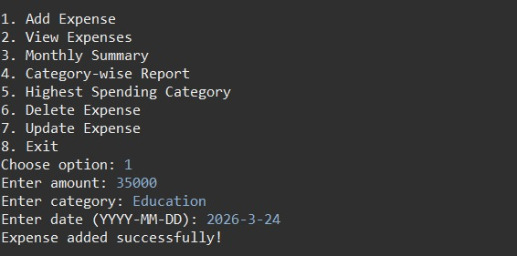
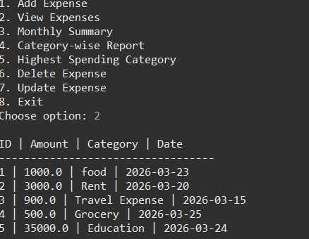
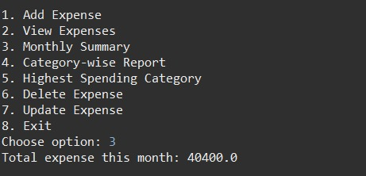
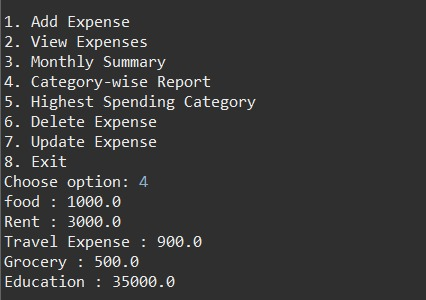
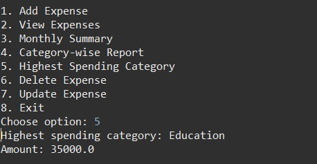

# 💰 Expense Tracker (Java + JDBC)

## 📌 Problem

Managing daily expenses manually is difficult and unorganized for students.

## 🚀 Solution

This project is a console-based Expense Tracker that helps users store, manage, and analyze expenses using a MySQL database.

## ✨ Features

* Add Expense
* View Expenses
* Update Expense
* Delete Expense
* Category-wise Expense Tracking
* Monthly Summary

## 🛠 Tech Stack

* Java
* JDBC
* MySQL

## ⚙️ How to Run

1. Create database:
   CREATE DATABASE expense_db;
2. Update DB credentials in `DBConnection.java`
3. Add MySQL Connector JAR
4. Run `MainApp.java`

## 📸 Output

### Add Expense

### View Expenses

### Monthly Summary

## Category-wise Report

### Highest Spending Category

## 📁 Project Structure

* DBConnection.java
* ExpenseOperations.java
* MainApp.java

## 🎯 Future Improvements

* GUI version
* Data visualization
* Multi-user login system
